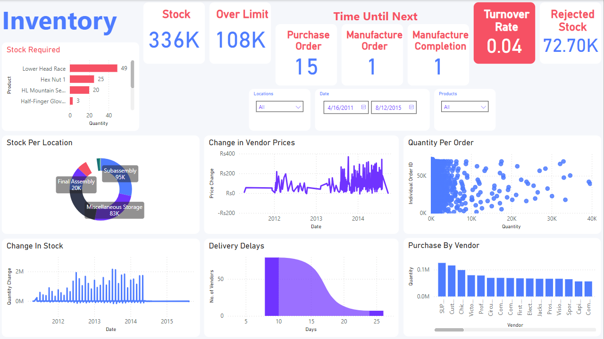
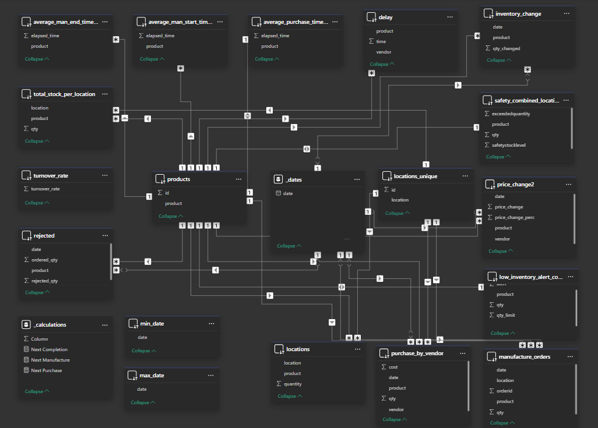

# Intro
A sql data analytics dashboard. Made using Microsoft SQL Server, AdventureWorks2022 database and Power BI. The target audience is inventory managers and the dashboard displays inventory insights and key performance metrics.

For aiding in analysis, we convert the tables and columns of the `database` into `yaml` files.

## Problems/Requirements
We help inventory managers of warehouses by dispaying information to help their daily responsibilities:
1. Monitoring Inventory
2. Monitoring Finances and Balance
3. Predicting Stock Demand and Delays
4. Any Issues

## KPIS / Metrics Proposed
1. Stock: Current levels, capacity, manufacture times
2. Purchase: Low inventory alert, expected demand
3. Turnover: Turnover rate, Daily operation rate
4. Vendors: Most used
5. Finances: Product costs, Profit vs turnover rate
6. Delays: Average delivery delay
7. Issues: Rejection rate, rejection to stocked ratio

More details at:
```
project
├───docs
    └───Proposal.pdf
```

# Schema



# Analysis
All analysis as sql views can be found in `./queries/views` folder.

# Data Source
https://learn.microsoft.com/en-us/sql/samples/adventureworks-install-configure?view=sql-server-ver16&tabs=ssms